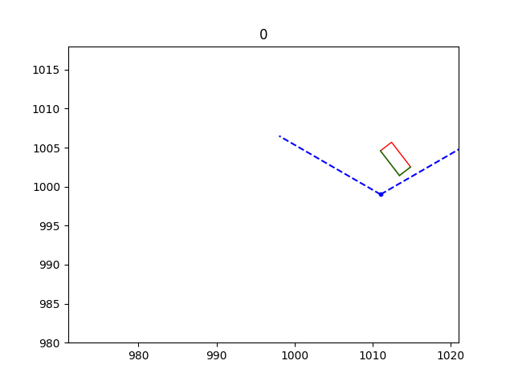
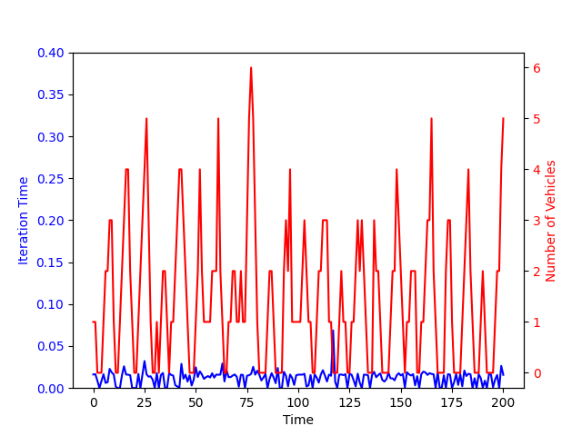

# SPART
Repository for the SPART Point Cloud Generation Framework

The main code is in the "2D_cars_line_blue_red_time.ipynb" Jupyter Notebook file. The datasets provided in the repository can be used to replicate the results.
The sample results on running the algorithm with vehicle_tracks_003 is as follows:

